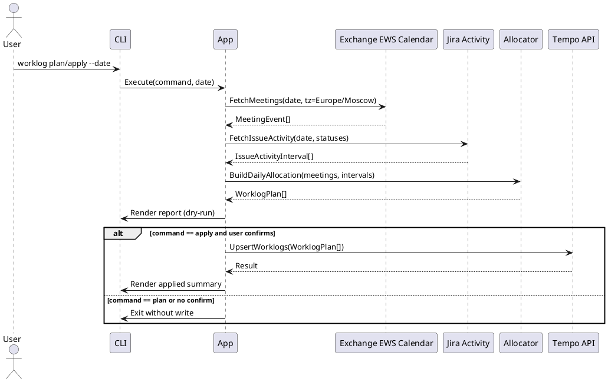

# Architecture Plan: Daily Tempo Worklog Automation (Go CLI)

## 1. Modules

### 1.1 CLI Layer
- `cmd/worklog/main.go`
- Парсинг команд:
  - `worklog plan --date YYYY-MM-DD`
  - `worklog apply --date YYYY-MM-DD`
- Подтверждение перед записью (`apply`).

### 1.2 Application Layer (`internal/app`)
- Оркестрация сценариев `Plan(date)` и `Apply(date)`.
- Сбор данных из календаря и Jira.
- Запуск расчетов и формирование итогового плана worklog.

### 1.3 Domain Layer (`internal/domain`)
- Сущности:
  - `MeetingEvent`
  - `IssueActivityInterval`
  - `WorklogEntry`
  - `DailyAllocation`
- Бизнес-правила:
  - regex `ODP-\d+`
  - `meeting_minutes_with_buffer = ceil(duration_minutes * 1.2)`
  - `remaining_minutes = max(0, 480 - sum(meeting_minutes_with_buffer))`
  - распределение остатка по активным задачам
  - fallback в `ODP-2933`.

### 1.4 Integration Layer
- `internal/integrations/ews`
  - NTLM-аутентификация к корпоративному Exchange EWS
  - SOAP `FindItem` по календарю за день (Europe/Moscow)
- `internal/integrations/jira`
  - Получение activity/changelog за день
  - Построение интервалов в статусах `In Progress` и `Подтверждение`
  - Учет reassignment (обрезка интервала до момента смены исполнителя)
- `internal/integrations/tempo`
  - Создание worklog
  - Проверка существующих worklog за дату для идемпотентности

### 1.5 Infra/Support
- `internal/config` — env-конфигурация.
- `internal/logging` — structured logs.
- `internal/timeutil` — timezone, нормализация day boundaries.
- `internal/report` — вывод таблицы dry-run/apply.

## 2. Data Flow (PlantUML)



## 3. API Contracts (OpenAPI)

Ниже контракты внутреннего orchestration API (для четкой спецификации поведения). Реализация в v1 остается CLI-only, но структура контрактов фиксирует входы/выходы для тестирования и возможного REST-обёртывания в будущем.

```yaml
openapi: 3.0.3
info:
  title: Worklog Planner API (internal contract)
  version: 1.0.0
paths:
  /v1/worklogs/plan:
    post:
      summary: Build worklog plan for a date (dry-run)
      requestBody:
        required: true
        content:
          application/json:
            schema:
              $ref: '#/components/schemas/PlanRequest'
      responses:
        '200':
          description: Plan calculated
          content:
            application/json:
              schema:
                $ref: '#/components/schemas/PlanResponse'
        '400':
          description: Validation error
        '502':
          description: Upstream API failure
  /v1/worklogs/apply:
    post:
      summary: Apply precomputed plan to Tempo
      requestBody:
        required: true
        content:
          application/json:
            schema:
              $ref: '#/components/schemas/ApplyRequest'
      responses:
        '200':
          description: Worklogs applied
          content:
            application/json:
              schema:
                $ref: '#/components/schemas/ApplyResponse'
        '409':
          description: Duplicate/conflict
        '502':
          description: Upstream API failure
components:
  schemas:
    PlanRequest:
      type: object
      required: [date, timezone]
      properties:
        date:
          type: string
          format: date
        timezone:
          type: string
          example: Europe/Moscow
    WorklogItem:
      type: object
      required: [issueKey, minutes, source]
      properties:
        issueKey:
          type: string
          example: ODP-1234
        minutes:
          type: integer
          minimum: 0
        source:
          type: string
          enum: [meeting, activity]
        comment:
          type: string
    PlanResponse:
      type: object
      required: [date, totalMinutes, items]
      properties:
        date:
          type: string
          format: date
        totalMinutes:
          type: integer
        items:
          type: array
          items:
            $ref: '#/components/schemas/WorklogItem'
    ApplyRequest:
      type: object
      required: [date, items]
      properties:
        date:
          type: string
          format: date
        items:
          type: array
          items:
            $ref: '#/components/schemas/WorklogItem'
    ApplyResponse:
      type: object
      required: [created, skipped]
      properties:
        created:
          type: integer
        skipped:
          type: integer
```

## 4. Data Storage / DB Changes
- Внешняя БД не требуется.
- Локальное хранение:
  - Опциональный локальный state-файл для маркеров идемпотентности (если проверка через Tempo API недостаточна).
- Изменений схемы БД нет.

## 5. Failure Handling
- `EWS unavailable/auth failed`: завершить с ошибкой, показать понятное сообщение, запись не выполнять.
- `Jira unavailable`: завершить с ошибкой, запись не выполнять.
- `Tempo unavailable during apply`: fail-fast, показать сколько уже записано/пропущено.
- Невалидная дата/конфиг: ошибка валидации до внешних вызовов.
- Пустые встречи + пустая активность: сформировать 0-результат или fallback в `ODP-2933` (по утвержденному правилу).

## 6. Auto-Review (Security / Overengineering / Edge Cases / Scalability)

### Security Risks Checked
1. Риск хранения секретов в репозитории.
   - Решение: только env vars, без хранения в git.
2. Риск логирования паролей/токенов.
   - Решение: redact чувствительных полей в logger middleware.
3. Риск некорректного issue key из заголовка.
   - Решение: строгий regex whitelist `^ODP-\d+$` после извлечения.
4. Риск повторной записи.
   - Решение: идемпотентность через проверку существующих worklog и маркер комментария.

### Overengineering Check
- Отклонено добавление БД, очередей, scheduler и UI в v1.
- Оставлен CLI + модульные адаптеры как минимально достаточный дизайн.

### Missing Edge Cases Covered
- Пересечение встреч.
- Сумма встреч > 8ч.
- Множественные интервалы одной задачи в течение дня.
- Reassignment в середине дня.

### Scalability Notes
- Для одного пользователя и одного дня нагрузка низкая.
- Структура модулей позволяет позже добавить batch-режим по нескольким датам/пользователям.

### Architecture Review Result
- Статус: CLEAN (критических блокеров не выявлено после фикса решений выше).
